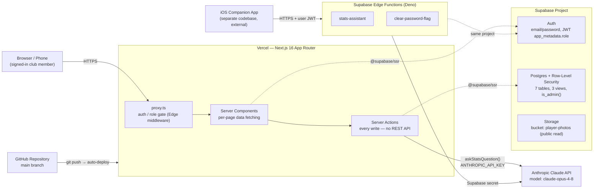
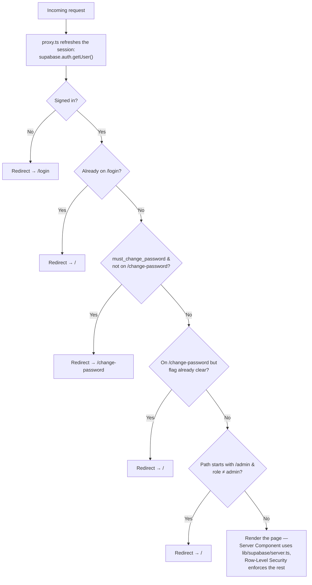
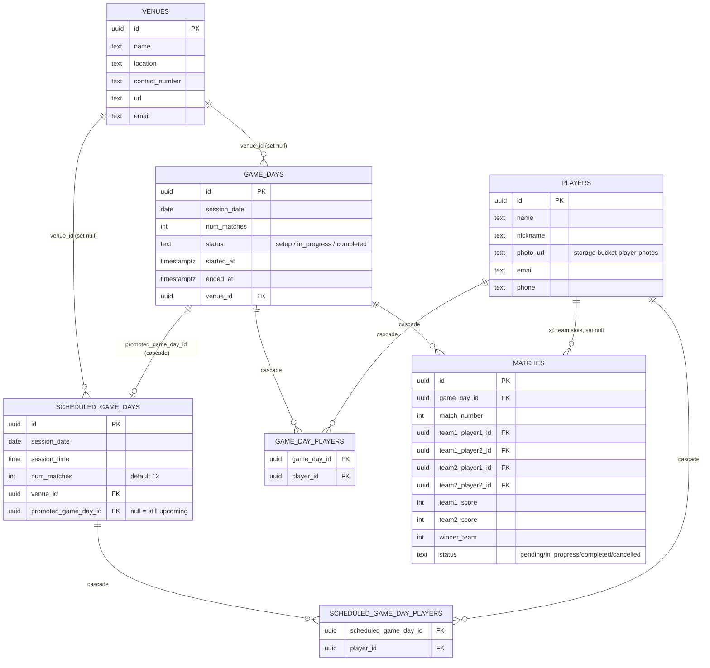
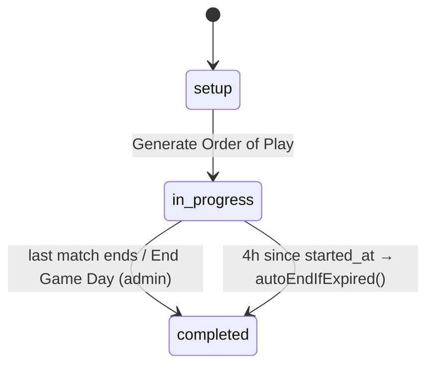
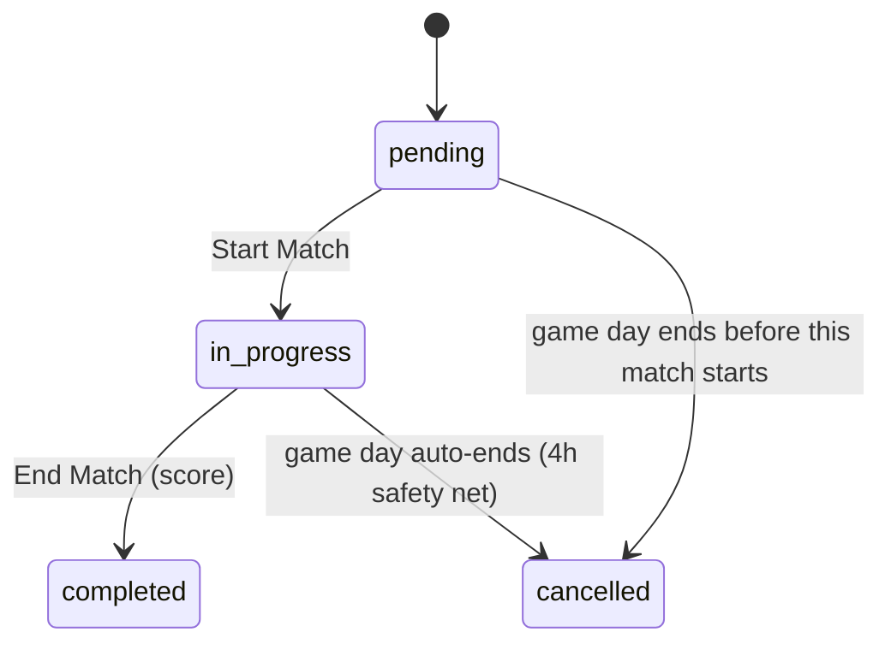

# Pickleball Manager — Technical Architecture

A mobile-friendly club-management app: player registration, game-day running with an
auto-generated doubles Order of Play, a scheduling calendar, and win/loss statistics with a
natural-language assistant. This document covers the stack, every integration point, the
database design, the full Server Action surface, configuration, and a file-by-file reference.

`Next.js 16 App Router` · `React 19` · `TypeScript` · `Tailwind CSS 4` · `Supabase` · `Vercel` · `Anthropic Claude API`

> An interactive version of this document (with hand-drawn diagrams and a sticky table of
> contents) was also published as a Claude Artifact during the same session this file was
> created in.

## Table of contents

- [Overview](#overview)
- [Tech stack](#tech-stack)
- [System & deployment architecture](#system--deployment-architecture)
- [Request & auth flow](#request--auth-flow)
- [Role-based access](#role-based-access)
- [Database design](#database-design)
- [Game Day & match lifecycle](#game-day--match-lifecycle)
- [Calendar auto-promotion](#calendar-auto-promotion)
- [Server Actions — the API surface](#server-actions--the-api-surface)
- [Environment variables](#environment-variables)
- [Supabase configuration](#supabase-configuration)
- [Vercel configuration](#vercel-configuration)
- [External systems](#external-systems)
- [Source file reference](#source-file-reference)
- [Testing & tooling](#testing--tooling)

## Overview

One Next.js application, one Supabase project, no separate backend service and no internal
REST API. Every read is a Server Component query against Supabase; every write is a Next.js
Server Action. A companion iOS app (a separate codebase, not in this repository) shares the
same Supabase project and reaches two small Edge Functions for the two operations it can't
perform safely from a mobile binary.

- **Frontend/backend** live together as one Next.js deployment on Vercel — Server Components
  render pages, Server Actions handle every mutation.
- **Database, auth, and file storage** are all Supabase: Postgres with Row-Level Security,
  email/password Auth with a role stored in the JWT, and a public Storage bucket for player
  photos.
- **One external AI integration**: the Statistics page's natural-language "Stats Assistant"
  calls the Anthropic Claude API directly from a Server Action.
- **No background jobs.** Two time-based behaviors — auto-ending a stale game day, and
  auto-promoting a due scheduled session into a real game day — run lazily on page load
  instead of on a cron schedule.

## Tech stack

| Layer | Choice | Notes |
|---|---|---|
| Framework | `next@16.2.10` | App Router, Turbopack, React Server Components, Server Actions. Middleware is named `src/proxy.ts` (Next 16 renamed `middleware.ts`). |
| UI runtime | `react@19.2.4`, `react-dom@19.2.4` | — |
| Language | TypeScript 5, strict mode | Path alias `@/*` → `src/*`. |
| Styling | Tailwind CSS 4 + shadcn/ui | Components generated onto `@base-ui/react` primitives (not Radix), configured via `components.json` (style `base-nova`). |
| Icons | `lucide-react` | — |
| Forms/validation | `zod` schemas inside Server Actions | `react-hook-form` and `@hookform/resolvers` are installed but unused — every form is native `FormData` + `useActionState`/`useTransition`. |
| Dates | `date-fns` | All date/time math and formatting. |
| Charts | `recharts` | Win/loss and venue-usage bar charts. |
| Toasts | `sonner` | Mounted once in the root layout. |
| Backend-as-a-service | Supabase (Postgres 15, Auth, Storage, Edge Functions) | `@supabase/ssr` + `@supabase/supabase-js`. |
| AI | Anthropic Claude API | `@anthropic-ai/sdk`; model `claude-opus-4-8` with structured JSON output. |
| Hosting/CI-CD | Vercel | Auto-deploys on push to `main` via the GitHub integration. |
| Testing | Vitest | Unit tests for the doubles-scheduling algorithm only. |

## System & deployment architecture

The web app is a single Vercel deployment talking to a single Supabase project. A separate iOS
app (out of scope for this repo) is drawn alongside because it shares the same Supabase backend
and explains why two Edge Functions exist in `supabase/functions/`.



The web app never talks to the Edge Functions — those exist solely for the iOS client, which
can't hold `ANTHROPIC_API_KEY` or `SUPABASE_SERVICE_ROLE_KEY` inside a distributed binary. Both
functions re-implement web app logic (`statistics/actions.ts` and `lib/actions/auth.ts`) against
the same Postgres/Auth project, verifying the caller's JWT instead.

## Request & auth flow

`src/proxy.ts` runs on every request matched by its `config.matcher` (everything except static
assets). It refreshes the Supabase session cookie and is the single authorization checkpoint —
every redirect decision in the app happens here, before a page ever renders.



Role comes from `user.app_metadata.role` — missing/null defaults to `"admin"` (pre-RBAC accounts
stay usable). Same-shaped guards are re-checked deeper in the stack: page components call
`requireAdminPage()`/`getCurrentRole()`, and every Server Action calls `assertAdmin()` or
`assertAuthenticated()` — defense in depth, since Server Actions are reachable as direct POST
endpoints independent of page rendering.

## Role-based access

Two roles, stored in `user.app_metadata.role` (part of the JWT, not a DB row): `admin` and
`viewer`. A missing/null role is treated as `admin` — this is what keeps accounts created
before roles existed fully usable with no data migration.

| Action | Any signed-in user | Admin only |
|---|---|---|
| View any page/data | ✓ | |
| Create/run a Game Day, manage its roster, start/end matches | ✓ | |
| Schedule / edit / cancel a Calendar session | ✓ | |
| Register a *brand-new* player | | ✓ |
| Edit/delete an existing player or venue | | ✓ |
| Delete a Game Day, or end one early | | ✓ |
| Admin page (users, Delete All Game Data) | | ✓ |

Enforcement is layered three times: the `proxy.ts` redirect gate, a page-level
`requireAdminPage()`/role check, and the underlying Postgres RLS policy — so a bug in any one
layer doesn't expose data.

## Database design

7 tables plus 3 read-only statistics views, all in the `public` schema of the single Supabase
Postgres database. `supabase/schema.sql` is the single source of truth — it's hand-run in the
Supabase SQL Editor (idempotent, safe to re-run) rather than managed through Supabase's
migration tooling.



`players.photo_url` is a public URL into the `player-photos` Storage bucket — not a foreign key.
Deleting a `venue` or a `player` never deletes history (those FKs use `on delete set null`).
Deleting a `game_day` cascades its roster and matches, and — since a recent fix — any scheduled
session that had already been promoted into it.

> **Why `promoted_game_day_id` cascades instead of nulling.** It originally used
> `on delete set null`, matching every other FK in the schema. But a past-due scheduled session
> with a null `promoted_game_day_id` looks exactly like one that was never promoted — so
> deleting the resulting Game Day made the lazy auto-promotion check recreate it on the very
> next page load. Changing that one FK to `on delete cascade` means deleting the Game Day also
> removes the scheduling record that produced it, closing the loop.

### Statistics views

| View | Purpose |
|---|---|
| `match_player_results` | Unpivots the 4 player slots per match into one row per (match, player, partner, won?) — the shared base the other two views aggregate. |
| `player_stats` | Per-player matches played / wins / losses, joined back to `players` so every registered player appears even with 0 matches. |
| `partnership_stats` | Per-partnership (unordered pair, via `least`/`greatest`) matches played / wins / losses. |

All three are declared `with (security_invoker = true)`, so they run under the querying user's
own RLS policies rather than the view owner's. `src/lib/stats.ts`'s `computeMatchStats()`
recomputes the same aggregates client-side in memory for statistics scoped to a single Game Day
(a parameterized SQL view wasn't worth the extra schema surface for that one drill-down page).

## Game Day & match lifecycle

Both status machines are advanced by Server Actions during normal use. One safety net —
`autoEndIfExpired()` — force-closes a Game Day that's been `in_progress` for more than 4 hours,
in case nobody remembered to end it.





A match left `pending` when its Game Day is already `completed` is rendered as "Cancelled" even
before the row is updated (`isCancelled` in `MatchCard` and the per-game-day statistics page) —
covering the moment between a manual "End Game Day" and the row-level cancellation that
`endGameDay()` and `autoEndIfExpired()` both perform.

## Calendar auto-promotion

The Calendar page lets any signed-in user plan a session ahead of time — date, time, venue, and
roster — without creating a real Game Day yet. There's no cron job; a scheduled session turns
into a real Game Day the next time anyone loads a page that checks for due sessions.

```mermaid
sequenceDiagram
    participant User
    participant UI as Calendar UI
    participant Create as createScheduledSession()
    participant SGD as scheduled_game_days
    participant Load as Any page load<br/>(/schedule, /game-days, /)
    participant Promote as autoPromoteDueScheduledSessions()
    participant GD as game_days

    User->>UI: Pick a future day, fill in time / venue / players
    UI->>Create: submit
    Create->>SGD: insert row (promoted_game_day_id = null)
    Note over SGD: Time passes — session_date + session_time<br/>(club UTC+8) is now in the past
    Load->>Promote: runs on every load (same lazy pattern as autoEndIfExpired)
    Promote->>SGD: query rows where promoted_game_day_id is null and due
    Promote->>GD: insert game_days row (+ copy roster into game_day_players)
    Promote->>SGD: set promoted_game_day_id on the originating row
```

What the Calendar page shows, given the above:

- **Day marker (dot)** — drawn for every `scheduled_game_days` row for that date, promoted or
  not, so a day stays marked even after its session becomes a real Game Day.
- **"Upcoming Sessions" list** — filtered to `promoted_game_day_id IS NULL`; once a session
  promotes, it drops off this list (it's now a real Game Day instead).
- **Click a day / list row** — opens the same dialog to create, edit, or cancel. Past days are
  not clickable, and the date field's `min` blocks picking a past date (both client-side and
  re-checked in the Server Action).

The same due-session check also runs from the Game Days page and the Dashboard, so a session
gets promoted from whichever page the next visitor happens to load first.

## Server Actions — the API surface

There is no `app/api/` route handler and no separate REST/GraphQL API. Every mutation is a
Next.js Server Action — an async function marked `"use server"`, called directly from a Client
Component like a normal function, compiled by Next.js into a POST endpoint under the hood. All
of them re-check authorization server-side even though the pages calling them already sit
behind `proxy.ts`.

**Auth & session** — `src/lib/actions/auth.ts`

| Action | Who | Purpose |
|---|---|---|
| `login` | public | Validates credentials with Zod, signs in via Supabase Auth, redirects to the Dashboard. |
| `logout` | any user | Signs out, redirects to `/login`. |
| `updateOwnPassword` | any user | Sets a new password, then clears `must_change_password` via the service-role client (that flag isn't self-editable through `auth.updateUser`). |

**Players** — `src/app/(app)/players/actions.ts`

| Action | Who | Purpose |
|---|---|---|
| `createPlayer` | admin | Registers a player; uploads an optional photo to the `player-photos` bucket first. |
| `updatePlayer` | admin | Edits name/nickname/email/phone/photo. |
| `deletePlayer` | admin | Deletes the player row (their slot in past matches becomes "Removed player"). |

**Venues** — `src/app/(app)/venues/actions.ts`

| Action | Who | Purpose |
|---|---|---|
| `createVenue` / `updateVenue` | admin | Manage a venue; a bare domain like `example.com` is auto-prefixed to `https://`. |
| `deleteVenue` | admin | Deletes the venue (Game Days that used it keep their other data, lose the reference). |

**Game Days** — `src/app/(app)/game-days/actions.ts` & `[id]/actions.ts`

| Action | Who | Purpose |
|---|---|---|
| `createGameDay` | any user | Creates a `game_days` row, redirects to its detail page. |
| `addPlayerToRoster` / `addAllPlayersToRoster` / `removePlayerFromRoster` | any user | Manage `game_day_players` for one session. |
| `registerAndAddPlayer` | admin | Registers a brand-new player and adds them to this roster in one step. |
| `generateSchedule` | any user | Runs `generateOrderOfPlay()`, replaces existing matches; refuses once any match has started. |
| `startMatch` | any user | Marks a match `in_progress`, stamps the Game Day's own `started_at` the first time. |
| `endMatch` | any user | Records the final score/winner/duration; completes the Game Day if that was the last unfinished match. |
| `endGameDay` | admin | Force-completes a session; cancels any match that never started. |
| `deleteGameDay` | admin | Deletes the Game Day (cascades roster + matches + any scheduled session that had promoted into it). |

**Calendar** — `src/app/(app)/schedule/actions.ts`

| Action | Who | Purpose |
|---|---|---|
| `createScheduledSession` / `updateScheduledSession` | any user | Plan or edit a future session; Zod rejects a `session_date` earlier than "today" in the club's timezone. |
| `deleteScheduledSession` | any user | Cancels a planned session outright. |

**Statistics** — `src/app/(app)/statistics/actions.ts`

| Action | Who | Purpose |
|---|---|---|
| `askStatsQuestion` | any user | Serializes players/game days/matches/venues to JSON, sends it + the question + chat history to Claude, returns a structured `{ answer, inScope, table }`. |

**Admin** — `src/app/(app)/admin/actions.ts`

| Action | Who | Purpose |
|---|---|---|
| `deleteAllGameData` | admin | Deletes every row in `game_days` (cascades `game_day_players`, `matches`, and any already-promoted `scheduled_game_days`). Players, venues, and still-upcoming scheduled sessions are untouched. |
| `createAppUser` | admin | Creates a Supabase Auth user (service-role client) with a temporary password and the `viewer` role. |
| `resetUserPassword` | admin | Resets a user's password and re-flags `must_change_password`. |
| `deleteAppUser` | admin | Deletes a Supabase Auth user (can't delete your own signed-in account). |
| `listAppUsers` | admin | Lists all Auth users with role/status, for the Admin page table. |

**Outside the Server Action surface:**

- `src/proxy.ts` — runs on every request; not callable, but the single authorization
  checkpoint (see [Request & auth flow](#request--auth-flow)).
- Supabase Edge Functions — separate deployable HTTP endpoints, called only by the iOS app:
  `POST …/functions/v1/stats-assistant` and `POST …/functions/v1/clear-password-flag`. See
  [External systems](#external-systems).

## Environment variables

Four variables total, defined in `.env.example` and set locally in `.env.local` (gitignored).
The same four are set again in Vercel's dashboard for production/preview deployments.

| Variable | Exposure | Used by | Purpose |
|---|---|---|---|
| `NEXT_PUBLIC_SUPABASE_URL` | public (client bundle) | `lib/supabase/client.ts`, `server.ts`, `admin.ts`, `proxy.ts` | The Supabase project's REST/Auth endpoint. |
| `NEXT_PUBLIC_SUPABASE_ANON_KEY` | public (client bundle) | same as above | Anon key — safe to expose; every access it grants is still bounded by Row-Level Security. |
| `SUPABASE_SERVICE_ROLE_KEY` | server-only | `lib/supabase/admin.ts` (guarded by the `server-only` import, which hard-errors at build time if ever imported from client code) | Bypasses RLS entirely — powers Admin's user management (create/reset/delete Auth users) and clearing `must_change_password`. |
| `ANTHROPIC_API_KEY` | server-only | `statistics/actions.ts` (and separately, as a Supabase secret, by the `stats-assistant` Edge Function) | Authenticates calls to the Anthropic Claude API for the Stats Assistant. |

Missing `ANTHROPIC_API_KEY` or `SUPABASE_SERVICE_ROLE_KEY` doesn't crash the app — both call
sites catch the failure and surface a specific, actionable error message ("an admin needs to
add …") instead.

## Supabase configuration

**Setting up a project**

1. Create a Supabase project, then run the entire contents of `supabase/schema.sql` once in
   **SQL Editor → New query**. It creates all 7 tables, indexes, RLS policies, the 3 statistics
   views, the `is_admin()` function, and the `player-photos` storage bucket + its policies.
   Every statement uses `if not exists` / `or replace` / drop-then-create, so re-running it
   after a schema update is safe.
2. Create the first user under **Authentication → Users** — with no `app_metadata.role` set,
   that account defaults to `admin`.
3. Copy the **Project URL** and **anon public** key from **Project Settings → API** into
   `.env.local`.

**Row-Level Security policy shape**

Every table follows the same two-policy pattern: an `"authenticated read"` policy
(`auth.uid() is not null`) open to any signed-in user, and a write policy that's either also
open to any signed-in user (`"authenticated write"` / `insert` / `update`) or restricted to
`public.is_admin()` (`"admin write"`), matching the [role table](#role-based-access) above.

```sql
create or replace function public.is_admin()
returns boolean language sql stable as $$
  select coalesce(auth.jwt() -> 'app_metadata' ->> 'role', 'admin') = 'admin';
$$;
```

`is_admin()` reads the role straight out of the request's JWT — no round trip to a separate
roles table — and defaults missing/null to `'admin'`, mirroring `roleFromAppMetadata()` on the
application side.

**Storage**

One public bucket, `player-photos`: anyone can `select` (public read, so `` tags load
directly from the public URL with no signed-URL dance), but only admins can
`insert`/`update`/`delete` objects in it — matching who may create/edit a player.

**Edge Functions (Deno runtime)**

| Function | Mirrors | Deploy |
|---|---|---|
| `stats-assistant` | `statistics/actions.ts`'s `askStatsQuestion` — same prompt, dataset shape, model, JSON schema | `supabase functions deploy stats-assistant`, then `supabase secrets set ANTHROPIC_API_KEY=…` |
| `clear-password-flag` | `lib/actions/auth.ts`'s post-password-change cleanup | `supabase functions deploy clear-password-flag` (service-role key is already available to Edge Functions automatically) |

Both verify the caller's JWT (an Edge Function default) before doing anything — the mobile
client authenticates as the signed-in user, never as service-role.

## Vercel configuration

- **Deploy trigger:** Vercel's GitHub integration auto-builds and deploys on every push to
  `main` (and preview-deploys other branches/PRs) — there's no `vercel.json` in the repo; all
  settings live in the Vercel project dashboard.
- **Environment variables:** the same four from [above](#environment-variables), added under
  **Project Settings → Environment Variables** for Production (and Preview, if you want preview
  deploys to work against the same or a staging Supabase project).
- **Build:** standard Next.js build (`next build`) — no custom build command needed.
  `tsconfig.json` excludes `supabase/functions` from the TypeScript project, since those run on
  Deno, not Node, and would otherwise fail the build's type check.
- **Runtime:** `src/proxy.ts` runs on Vercel's Edge/middleware runtime for every non-static
  request (see its `config.matcher`).
- **Local-network dev:** `next.config.ts` sets `allowedDevOrigins` so the dev server accepts
  requests (including Server Actions) from another device on the same Wi-Fi — used for testing
  the photo-upload/camera flow from an actual phone before deploying.

## External systems

**Anthropic Claude API**

The only third-party API the web app calls. `statistics/actions.ts`'s `askStatsQuestion()`
sends the entire current dataset (players, game days, matches, venues — trimmed to just the
fields the assistant needs) as JSON inside the system prompt, plus the user's question and
prior chat turns, to `claude-opus-4-8` with `output_config.format = json_schema` so the response
is guaranteed `{ answer, in_scope, table }` rather than free-form prose that would need fragile
parsing.

**Companion iOS app**

A separate codebase (not in this repository) that reads/writes the *same* Supabase project —
same tables, same RLS policies, same Auth users. It can't safely embed `ANTHROPIC_API_KEY` or
`SUPABASE_SERVICE_ROLE_KEY` inside a distributed app binary, so for the two operations that need
one of those secrets, it calls the `stats-assistant` and `clear-password-flag` Edge Functions
instead — each one holds the relevant secret server-side and verifies the caller's own JWT
before acting.

> The `supabase/functions/` directory is **not tracked by this repository's git history** —
> it's present on disk but excluded from version control here, since it belongs to the iOS
> app's own release process. It's documented above only because it's part of the same running
> system and explains two files that would otherwise look orphaned.

## Source file reference

Every file under `src/` and `supabase/`, grouped by directory.

### `src/app/` — routes (App Router)

| File | What it does |
|---|---|
| `layout.tsx` | Root HTML document; loads the Geist fonts, mounts the global `<Toaster/>` used by every page's success/error toasts. |
| `globals.css` | Tailwind v4 theme tokens (shadcn palette), light/dark CSS variables, print stylesheet for the Stats Assistant's "save as PDF" export. |
| `login/page.tsx` | Public sign-in form; calls `login()`. |
| `change-password/page.tsx` | Forced password-reset screen shown when `must_change_password` is set; calls `updateOwnPassword()`. |
| `(app)/layout.tsx` | Shared layout for every page behind auth: fetches the current user/role once, renders `<Nav>`, centers page content in a max-width column. |
| `(app)/page.tsx` | Dashboard: player count, Game Days/Calendar/Statistics quick-link cards, Upcoming Sessions, Top Players/Teams, a horizontally-scrolling Recent Game Days list. |
| `(app)/players/page.tsx` | Players grid. |
| `(app)/players/actions.ts` | Server Actions: `createPlayer`, `updatePlayer`, `deletePlayer`. |
| `(app)/players/[id]/page.tsx` | Player profile: overall record, per-partner win/loss breakdown, full match history. |
| `(app)/venues/page.tsx` | Venues grid. |
| `(app)/venues/actions.ts` | Server Actions: `createVenue`, `updateVenue`, `deleteVenue`. |
| `(app)/game-days/page.tsx` | Game Days list; runs `autoEndIfExpired` and `autoPromoteDueScheduledSessions` on load. |
| `(app)/game-days/actions.ts` | Server Action: `createGameDay`. |
| `(app)/game-days/[id]/page.tsx` | Single Game Day: roster panel + Order-of-Play match cards. |
| `(app)/game-days/[id]/actions.ts` | Server Actions: roster add/remove/add-all, register-and-add, `generateSchedule`, `startMatch`, `endMatch`, `endGameDay`, `deleteGameDay`. |
| `(app)/schedule/page.tsx` | Calendar page: month grid + Upcoming Sessions list; runs auto-promotion on load. |
| `(app)/schedule/actions.ts` | Server Actions: `createScheduledSession`, `updateScheduledSession`, `deleteScheduledSession`. |
| `(app)/statistics/page.tsx` | Club-wide statistics: Stats Assistant, win/loss chart, team-pairings table, Game Day history, games-per-venue chart. |
| `(app)/statistics/actions.ts` | Server Action: `askStatsQuestion` (the Claude API call). |
| `(app)/statistics/[gameDayId]/page.tsx` | Per-Game-Day statistics drill-down. |
| `(app)/admin/page.tsx` | Admin-only: user management table + Delete All Game Data. |
| `(app)/admin/actions.ts` | Server Actions: `deleteAllGameData`, `createAppUser`, `resetUserPassword`, `deleteAppUser`, `listAppUsers`. |

### `src/lib/` — shared logic

| File | What it does |
|---|---|
| `supabase/client.ts` | Browser Supabase client factory (anon key). |
| `supabase/server.ts` | Server Supabase client factory bound to Next.js cookies — every read/write goes through this, so it's the client whose queries RLS actually evaluates against. |
| `supabase/admin.ts` | Service-role client that bypasses RLS; guarded by the `server-only` package so importing it from client code is a build error. |
| `auth-role.ts` | Role model (`admin`/`viewer`) and guards: `getCurrentRole`, `assertAdmin`, `assertAuthenticated`, `requireAdminPage`. |
| `actions/auth.ts` | `login`, `logout`, `updateOwnPassword`. |
| `game-day-lifecycle.ts` | `autoEndIfExpired` — lazy 4-hour safety net that force-completes a stuck Game Day. |
| `scheduled-game-day-promotion.ts` | `autoPromoteDueScheduledSessions` + `clubTodayDateString` — lazy promotion of due Calendar sessions into real Game Days, timezone-safe against the club's UTC+8. |
| `scheduler.ts` | `generateOrderOfPlay` — the doubles Order-of-Play algorithm (partner rotation, sit-out fairness, deterministic seeded PRNG). |
| `scheduler.test.ts` | Vitest suite checking the algorithm's fairness rules hold across every supported player count. |
| `stats.ts` | `computeMatchStats` — in-memory equivalent of the `player_stats`/`partnership_stats` views, scoped to one Game Day. |
| `format.ts` | Date/duration formatting helpers: `formatTime`, `formatTimeOfDay`, `formatDuration`, `formatHoursMinutes(Between)`. |
| `types.ts` | Shared TypeScript types mirroring the DB rows: `Player`, `Venue`, `GameDay`, `Match`, `ScheduledGameDay`, `PlayerStats`, `PartnershipStats`. |
| `utils.ts` | `cn()` — Tailwind class-merging helper (clsx + tailwind-merge), used by every shadcn component. |

`src/proxy.ts` — route-protection middleware (Next.js 16's renamed `middleware.ts`); see
[Request & auth flow](#request--auth-flow) for the full decision tree.

### `src/components/` — UI

| File | What it does |
|---|---|
| `nav.tsx` | Top nav bar (desktop) / bottom tab bar (mobile); role-filtered link list; sign-out. |
| `pickleball-icon.tsx` | Inline SVG brand mark used in the nav. |
| `dashboard/session-scroller.tsx` | Horizontally-scrolling "Recent Game Days" cards, grouped by date, for the Dashboard. |
| `game-days/new-game-day-dialog.tsx` | Create-Game-Day dialog (date, match count, venue picker with inline "add venue"). |
| `game-days/roster-panel.tsx` | Roster add/remove/add-all/register-new UI + the "Generate/Regenerate Order of Play" form. |
| `game-days/match-card.tsx` | One match: live running timer, Start/End Match controls, score-entry dialog. |
| `game-days/end-game-day-dialog.tsx` | Confirm-and-end-Game-Day dialog (admin only). |
| `game-days/delete-game-day-button.tsx` | Confirm-and-delete-Game-Day icon button (admin only). |
| `schedule/calendar-view.tsx` | Month calendar grid; blocks past-day clicks; day click opens the scheduling dialog. |
| `schedule/scheduled-session-dialog.tsx` | Create/edit dialog for a scheduled session (date, time, venue, players, "Add All Players"). |
| `schedule/scheduled-sessions-list.tsx` | Upcoming-sessions list, reused on both the Calendar page and the Dashboard. |
| `schedule/delete-scheduled-session-button.tsx` | Confirm-and-cancel-session icon button, inline in the list. |
| `players/player-card.tsx` | Player grid card: photo, contact info, W/L record, admin edit/delete. |
| `players/player-dialog.tsx` | Create/edit player dialog, including client-side photo resize/re-encode before upload. |
| `venues/venue-card.tsx` | Venue grid card with admin edit/delete. |
| `venues/venue-dialog.tsx` | Create/edit venue dialog. |
| `statistics/stats-chatbot.tsx` | Stats Assistant chat UI: question box, threaded Q&A dialog, print-to-PDF. |
| `statistics/stats-charts.tsx` | Recharts win/loss stacked bar chart per player. |
| `statistics/venue-chart.tsx` | Recharts sessions-per-venue bar chart. |
| `statistics/partnership-table.tsx` | Sortable team-pairing win/loss table. |
| `admin/add-user-form.tsx` | Add-viewer-account form. |
| `admin/user-row.tsx` | One user row: role badge, reset-password, delete-user, each behind its own confirm dialog. |
| `admin/delete-all-dialog.tsx` | Confirm-and-wipe-game-data dialog. |
| `ui/formatted-time.tsx` | Defers a timestamp's formatting until after hydration so it renders in the *viewer's* timezone rather than the server's (Vercel runs UTC). |
| `ui/*` (remaining 13 files) | shadcn/ui primitives generated onto `@base-ui/react`: `button`, `card`, `dialog`, `alert-dialog`, `avatar`, `badge`, `input`, `label`, `select`, `separator`, `sonner` (toast host), `table`, `tabs`, `textarea`. |

### `supabase/`

| File | What it does |
|---|---|
| `schema.sql` | The entire DB schema — tables, indexes, RLS policies, `is_admin()`, statistics views, storage bucket + policies. Hand-run in the SQL Editor; idempotent. |
| `functions/stats-assistant/index.ts` | Edge Function used by the iOS app to reach Claude (mirrors `statistics/actions.ts`). Not tracked by this repo's git history. |
| `functions/clear-password-flag/index.ts` | Edge Function used by the iOS app after a self-service password change. Not tracked by this repo's git history. |

## Testing & tooling

| File | What it does |
|---|---|
| `next.config.ts` | `allowedDevOrigins` for testing from a phone on the local network. |
| `tsconfig.json` | Strict TypeScript; path alias `@/*` → `src/*`; excludes `supabase/functions` (Deno, not Node). |
| `components.json` | shadcn/ui CLI config: `base-nova` style, RSC-aware, `@base-ui/react` primitives, Lucide icons. |
| `eslint.config.mjs` | `next/core-web-vitals` + `next/typescript` rule sets. |
| `vitest.config.ts` | Node environment, same `@` alias as the app, used only by `scheduler.test.ts`. |
| `postcss.config.mjs` | Tailwind v4 PostCSS plugin. |

`npm test` runs the scheduler's unit tests independent of Supabase — the only part of the
codebase with meaningful pure logic to unit test; everything else is thin Server
Actions/Components over the database.
